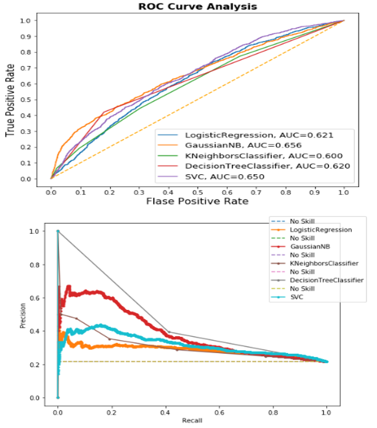
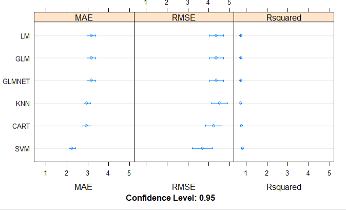
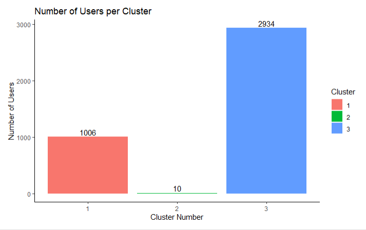

# Kevin_Portfolio
Data Science Portfolio

# 1.Python Projects

## [Project 1: Spam SMS Classification with deployment](https://github.com/kevin-v-kurian/Natural-Language-Processing-Projects)

Solved a NLP problem to classify smas as spam or not using NLTK library and deployed a Machine Learning web app for it created with Flask on Heroku. <https://spam-sms-finder.herokuapp.com/>

## [Project 2:Credit Card Default(PGP Capstone Project)](https://github.com/kevin-v-kurian/Capstone-Project-Credit-Card-Default)
Analyzed credit card data collected from Taiwan-based credit card issuer and used various machine learning models to predict whether or not a consumer will default on their credit cards, as well as identify the key drivers behind this. This would inform the issuer’s decisions on who to give a credit card.

# 2.R Projects

## [Project 1:House Price Prediction](https://github.com/kevin-v-kurian/Projects-in-R)
It is a regression predictive modeling machine learning problem to predict house prices solved
from end-to-end using R. Specifically, the steps covered were:

1. Problem Definition (Boston house price data).
2. Analyze Data (some skewed distributions and correlated attributes).
3. Evaluate Algorithms (SVM with radial basis function looks good).
4. Feature Selection (removing correlated attributes didn't help).
5. Transforms (Box-Cox transform made things better).
6. Ensemble Methods (Bagging and Boosting)
7. Finalizing Best performing Algorith and Tuning it(in our case SVM)

## [Project 2:Customer Segmentation](https://github.com/kevin-v-kurian/Projects-in-R)
Customer Segmentation based on Unsupervised learning using K-Means and Hierarchical Clustering

Customer Segementation is used in marketing to better understand customers of a business and target them accordingly. 
Segmentation of customer can take many forms, based on demographic, geographic, interest, behavior or a combination of these characteristics. 
Segmentation for this analysis was conducted based on their purchase behavior, the features to be analyzed were Recency, Frequency and Monetary Value, (RFM)

